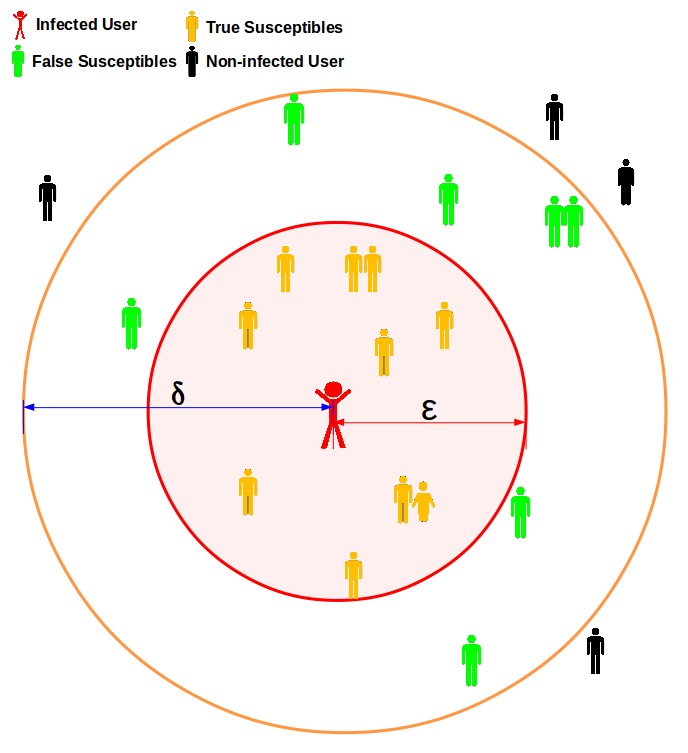

# Are You Covid-19 Positive? A Location Based Reality Check
In the present national emergency situation of coronavirus pandemic governments of all countries are trying to prevent massive propagation of that virus. To get a success in preventing propagation of the Covid-19 virus many governments have decided to keep the whole country locked down. According to expart’s opinion the ultimate success can be achieved by quarantining all Covid-19 positive patients and all those persons who came in contact or closer to these patients within last 15-20 days. Very often it is happening that some person who met the affected patient hides this information from local administration to avoid quarantine. In this situation the basic problem is finding out those vulnerable people, but this is a very hard problem because it is very difficult for the patient to remember who met him in the last 15-20 days. It is also difficult for someone to find out whether he/she came closer to an affected patient in the last few days. We have developed a location based coronavirus reality check system which enables users to find out whether he/she came closer to any Covid-19 positive patients.


# INFECTRACER

  

A tool to quickly locate a set of susceptible persons given a global database of user check-ins and a set of infected people.


### Extract the data

If you want to generate your own data (using a different simulation approach then read the Appendix section).  Else to conduct experiments on the provided dataset, simply execute

```
gunzip data/*
wc -l data/data.txt
wc -l data/data.txt.ext
```
for which you should see
```
266909 data/data.txt
1601454 data/data.txt.ext
```

### Approximate Retrieval Approach

The objective of the retrieval approach is then to find the set of ghost-users given a real user, because as per the ground-truth of the simulated data these (pseudo) users came in close contact with a known infected user. 

In a real life situation, one has a massive database of user checkins of a population out of which it is known that a number of persons are infected. The goal is to rapidly find the candidate set of people who came in close contact with the infected. However, a brute force search to locate the candidates would take a huge time (since it is a quadratic time complexity operation).

In our approach, we undertake an **approximate nearest neighbor* * search approach to solve the problem. The two main research questions in this setup are:

1. How does **efficiency** (run-time) vary with the fraction of people infected, e.g., if `10% of a population gets infected, is this still a feasible solution`?
2. What is the **effectiveness** of the approximate nearest neighbor search? Since it is an approximate method, it can make mistakes. Is there a satisfactory bound on the error rate?

 
 ### Indexing the Data
  
The next step is to install the `nmslib` library. Simply execute `pip install nmslib`. Make sure you have `numpy` installed (if not execute `pip install numpy`).

You then need to execute
```
python index_checkins.py -d data/data.txt.ext -i simusers.idx
``` 
where you specify the data file (comprising the user-id, locations, time-offsets) and the index file to save the data. The indexing step enables a very fast retrieval of susceptible cases.

### Retrieval of Candidate Infected Persons

The next step is to retrieve the susceptible cases. The program simulates the case that a fraction of the population (whose data exists in the index already) has been infected. The `retrieval` program formulates and executes a query for each of these infected people and reports a list of 3 most susceptible persons that came in close contact (in terms of space and time) with an infected person.

You simply need to execute
```
python retrieve_susceptibles.py -d data/data.txt.ext -i simusers.idx -s 0.01 -n 266909
``` 
where you specify the data file (to simulate infected people), the index file (to retrieve susceptible people) and the fraction infected (in the example set to `0.01` or `1%`).
The last argument is the number of real users in the data (this is useful for the program to compute the ground-truth information and compute recall).

The program prints out output in the following format:
```
Reading data file...
Loading user ids...
Loading user data...
Number of users infected: 2669
Search time = 0.055400
Avg. Recall = 0.9332
```
 
 The main usefulness of the program is the `lightning fast search` through millions of check-in locations identifying the susceptible people in real quick time. Exact brute force distance computation involves scanning through billions of check-in locations for each infected person (a new query), which is not scalable. Pandemics can be better fought if susceptible people to catch an infection are quickly identified and quarantined. We believe that this tool can contribute to such a cause. We also observe that the recall achieved is satisfactory.

Play around with the parameters, i.e., `s (fraction infected)` to see what effects does it have on the recall and search times.


### Appendix: To generate data from FourSquare Check-ins

#### Get the FourSquare Check-in data

Download the Foursquare global check-in data (https://drive.google.com/file/d/0BwrgZ-IdrTotZ0U0ZER2ejI3VVk/view) in the project folder. After the files are downloaded execute the script `prepdata.sh`
```
sh prepdata.sh
```
to create the data file (named `data.txt`). The script converts the date-time formatted data into epochs and creates a file in the following format.
```
<userid> <check-in lattitude> <check-in longitude> <offset (in epochs)>
50756  55.696132 37.557842  0
190571  41.029717 28.974420  1
221021  40.748939 -73.992280  2
66981  30.270753 -97.752936  2
21010  59.941041 30.308104  3
```

As a part of the repository, we provide a zipped version of this file `data/data.txt.gz`. Check that after unzipping it, and executing `wc -l`, you should see `266909` lines.


#### Generating Simulated User Overlap Data 

The real FourSquare check-in data is not directly applicable for our study because it is much less likely that two Foursquare users would check-in to the same location (a point-of-interest, e.g. a museum/restaurant) at near about the same time. However, to model an infectious disease spread, we need to have users that came in close contact with each other (in terms of both space and time).

We undertake a simple simulation model to generate pseudo-user interactions (likely contacts). First, we filter the `data.txt` file to retain only one check-in per user. This makes the simulation algorithm easier to manage.

Next, for each user `U` (having a unique id),  we generate a set of mutually exclusive `pseudo-users` or `ghost-users`, which comprises the ground-truth information for each user. Note that since all the original/real user-checkins were sufficiently apart in space-time coordinates, it is likely that the neighbourhood of a user comprised of the ghost-user check-ins are also far apart  (in which case one can rely with sufficient confidence on the simulated ground-truth data).
For each user `U` we generate `p+n` number of `ghost-user` in `$\delta$` neighbourhood, out of them `p` number of `ghost-users` are belong to `$\epsilon$` neighbourhood, if user `U` is positively infected person then these `p` `ghost-users` will be considered as  vulnerable person, whom we need to identify, and remaining `n` people will be considered as non-suspicious persons as they are in safe distance from the infected person `U`.  In the following figure we have shown a visualization of simulated `ghost-users` corresponding to a real infected user (red person in the figure).


To generate simulated data, simply execute
```
sh addusers.sh data.txt
```


Again, we provide a zipped version of this file as `data/data.txt.ext.gz`. Unzipping this file you should see `1601454` lines (`wc -l`).


### Results
To address the correctness of our algorithm we computed `Recall`as evaluation metric. As in our problem positively infected `ghost-users` should not slip away so `Recall` is a good choice as an evaluation metric. In our experiment we consider the number of `ghost-user` corresponding to a given user, `$\epsilon$` and `$\delta$` neighbourhood as parameters. In the following table we have presented our experimented results.

| #Users | Fraction<br>infected | #Infected | #Ghost | $\epsilon$ | $\delta$ | #Retrieved | Search<br>time | Recall |
|:------:|:--------------------:|:---------:|:------:|:----------:|:--------:|:----------:|:--------------:|:------:|
| 266909 | 0.01 | 2669 | 5 | 1 | 2 | 5 | 0.0774 | 0.9036 |
| 266909 | 0.02 | 5338 | 5 | 1 | 2 | 5 | 0.1569 | 0.9016 |
| 266909 | 0.03 | 8007 | 5 | 1 | 2 | 5 | 0.2559 | 0.9010 |
| 266909 | 0.04 | 10676 | 5 | 1 | 2 | 5 | 0.3087 | 0.9052 |